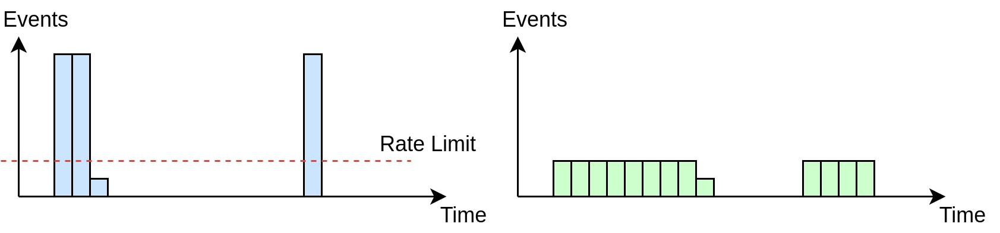

# Event Shaper

Shaper can enforce limit on maximum number of code executions per instance of time.
It is safe to adjust the rate limit in the runtime.

It can be usable in cases when:
* the source of events produces bursts of load followed by periods of silence
* we need to flatten the load before next stages of processing
* there is no back-pressure mechanism from the downstream stages
* we need to change the processing rate in the runtime

Go 1.15 required